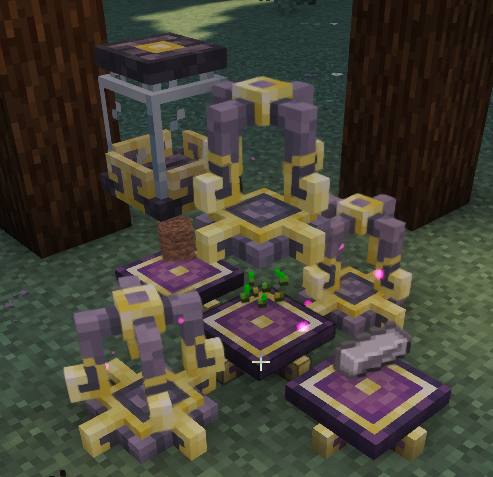
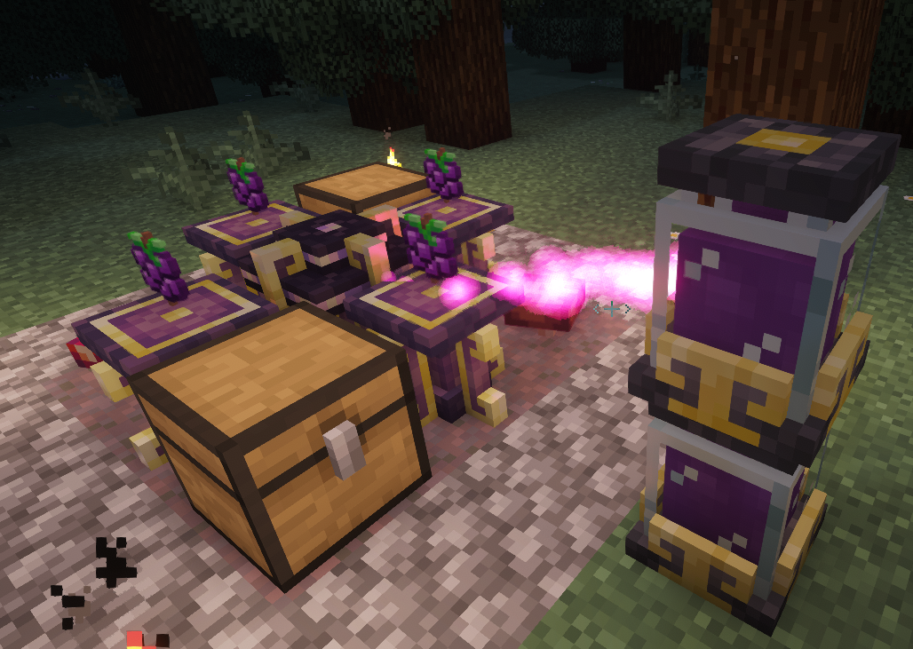
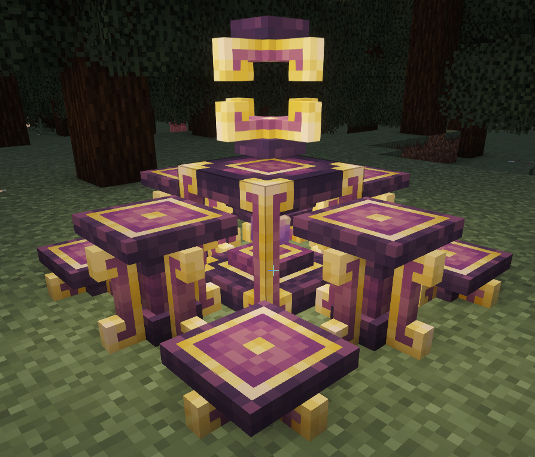

# Ars Nouveau &mdash; Machines &amp; Source

## Arcane Pedestals and Platforms

* These items function the same as they hold an item for rituals; it’s a matter of your preference.
* Pedestals take up one block for the base and the item sits on top
* Platforms are flatter to the ground and the base and item sit in the same single block (this is my personal preference as you can set up a multi-output structure more easily. See next section about the Chamber)

## Imbuement Chamber

* When placed into this chamber, Lapis and Amethyst can become **Source Gems** that are a big component to all crafting, you’ll be making a ton (eventually you’ll get a large auto farmed source from Amethyst)
    * **Magical Essences**: for crafting need an Imbuement Chamber and **3 Arcane Pedestals or Platforms** where on those pedestals, you place items associated with an element or a school of magic to change a Source Gem  into an Essence.
    * **Abjuration**: fermented spider eye, sugar, milk bucket
    * **Conjuration**: book, wilden horn, starbuncle token
    * **Manipulation**: clock, redstone, stone button
    * **Animus**: golden apple, wither skull, bonemeal
    * **Air**: arrow, wilden wing, feather
    * **Earth**: iron ingot, dirt (any), seeds (any)
    * **Fire**: flint and steel, torch, gunpowder
    * **Water**: water bucket, snow block, kelp
* It is important to note, the Imbuement Chamber does **NOT** consume items. They’re more like foci so it’s recommended to just have a  chest for those focal items so it’s easier to swap \- or if you got the space and feel like it, have multiple setups for each.
* Source can be used to speed up the processing of the chamber and a few late tier items require source.
* All pedestals with focal items and source jars need to be in 1 block of the chamber but it can be from any side or diagonal.

**Example:** This image is a setup where 3 Imbuement Chambers can use the same 3 platforms to make Earth Essence. This setup also lets all 3 use the same jar of source.

## SourceLinks

These devices will produce source and send it to a nearby Source Jar when a condition is met AND the jar has space for it. These 3 are easiest for starting source farms.

But there are a multitude of others that, depending on your automation, could also be beneficial to include:
* **Agronomic**: whenever a crop grows a stage, a little source is generated
* **Mycelial**: eats edible things on adjacent platforms/pedestals to produce source, it will also slowly make mycelium and mushrooms below it (may want to source a 3x3 with stone so you don’t get rampant mycelium everywhere). Higher quality foods give more source but the best is **Sourceberries**. (can use advanced hopper upgrade with chests from Sophisticated Storage to push items onto nearby platforms from multiple sides to automate it too\!)
* **Vitalic**: When nearby animals breed, grow up, or die, it will produce source.

Example of a **Mycelial SourceLink** set up with Sophisticated Storage:

## Enchanted Apparatus

This block is set on top of an **Arcane Core** as a 2 block structure for magical crafting.

* Up to **8 Arcane Pedestals or Platforms** are placed around the Enchanted Apparatus for the items required for the enchanting where the item that will be transformed will go into the Apparatus.
* This process **WILL** consume the items on the pedestals.
* Some rituals do not cost source, and some do.  Your worn notebook or JEI/EMI will show recipes and amount of source needed (each jar is 2000).
* The pedestals and jars within 3 blocks of the Apparatus to work and the items need to all be on the pedestals (order doesn’t matter) before placing the item to transform inside the Apparatus.

Example of my personal preferred setup to save space and easier item placement:

